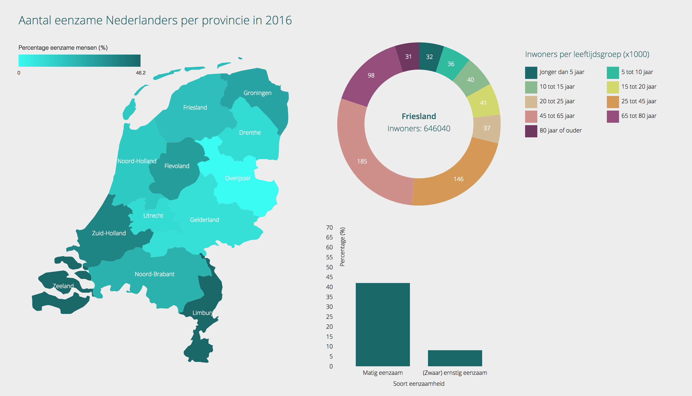

# Project Information Design 1 A



Voor dit gedeelte van project Information Design heb ik een datavisualisatie gemaakt dat het aantal eenzame Nederlanders per provincie in 2016 laat zien. Mijn onderwerp van Research for Data ging over ouderenzorg en eenzaamheid onder ouderen. Ik heb dit onderwerp aangepast naar de totale bevolking van Nederland, omdat er niet veel data valt te vinden over eenzaamheid alleen van ouderen.

## Data:

De twee datasets die ik hiervoor heb gebruikt zijn een dataset over de bevolking van Nederland per provincie en een dataset over het percentage eenzame inwoners van Nederland. Beide gaan alleen over 2016.

Ik heb beide datasets (.txt bestanden) omgezet naar CSV bestanden, door gebruik te maken van een map functie, zoals de volgende:

```
function map0 (d) {
	return {
		'region': regions[d[0]],
		'year': d[1].slice(0, 4),
		'totalPopulation': Number(d[2]),
		'age': [
			{
				'type': 'Jonger dan 5 jaar',
				'value': Number(d[3])
			},
			{
				'type': '5 tot 10 jaar',
				'value': Number(d[4])
			},
			{
				'type': '10 tot 15 jaar',
				'value': Number(d[5])
			},
			{
				'type': '15 tot 20 jaar',
				'value': Number(d[6])
			},
			{
				'type': '20 tot 25 jaar',
				'value': Number(d[7])
			},
			{
				'type': '25 tot 45 jaar',
				'value': Number(d[8])
			},
			{
				'type': '45 tot 65 jaar',
				'value': Number(d[9])
			},
			{
				'type': '65 tot 80 jaar',
				'value': Number(d[10])
			},
			{
				'type': '80 jaar of ouder',
				'value': Number(d[11])
			}
		]
	}			
}
```

## Opschoonproces:
De dataset over de bevolking is afkomstig van het [CBS](http://statline.cbs.nl/Statweb/publication/?DM=SLNL&PA=70072ned&D1=0,3-11&D2=0,5-16&D3=21&HDR=T&STB=G1,G2&VW=T) en de dataset over het percentage eenzame mensen is afkomstig van de website van [Volksgezondheid en zorg](https://www.volksgezondheidenzorg.info/onderwerp/eenzaamheid/regionaal-internationaal/regionaal#node-eenzaamheid-ggd-regio).

Beide datasets hadden een header en een footer die moesten worden verwijderd. Dit was de eerste stap die ik nam in het opschonen van de data:

```
var header = docs[i].indexOf('BEGIN DATA');
var start = docs[i].indexOf('\n', header);
var footer = docs[i].indexOf('END DATA.');
docs[i] = docs[i].slice(start, footer);
```

Daarna moesten eventuele komma's verandert worden in punten, zodat ze niet in de weg zaten voor de komma's die de verschillende data velden onderscheiden. Ook moesten eventuele spaties, tabs en enters verwijderd worden en moesten alle velden gescheiden worden door komma's:

```
docs[i] = docs[i].replace(/,+/g, '.')
	.replace(/ \n+/g, '\t')
	.replace(/ +/g, '\t')
	.replace(/\t+/g, ',')
	.trim();
```

Als laatste waren er nog een paar specifieke gevallen voor de eerste dataset die niet golden voor de tweede dataset. Deze heb ik apart behandeld:

```
docs[0] = docs[0].replace(/\n+/g, ',')
	.replace(/,NL+/g, '\nNL')
	.replace(/,PV+/g, '\nPV');
```

Nu is de data schoon en klaar voor gebruik.

## Interactie:

De interactie in deze visualisatie zit in het filteren van de data per provincie. Wanneer je op een provincie klikt, veranderen de data in de donut chart en bar chart, aan de hand van de data van die specifieke provincie. Daarnaast is er nog een tooltip voor de gegevens van de bar chart, wanneer je met je muis over een van de bars gaat.

## Features:

### D3 Features:

* [d3.geoPath](https://github.com/d3/d3-geo/blob/master/README.md#geoPath) `var path = d3.geoPath();`
* [d3.scaleLinear](https://github.com/d3/d3-scale/blob/master/README.md#scaleLinear) `var colorsMap = d3.scaleLinear()`
* [d3.scaleOrdinal](https://github.com/d3/d3-scale/blob/master/README.md#scaleOrdinal) `var xMap = d3.scaleOrdinal()`
* [d3.axisBottom](https://github.com/d3/d3-axis/blob/master/README.md#axisBottom) `var xAxisMap = d3.axisBottom(xMap);`
* [d3.arc](https://github.com/d3/d3-shape/blob/master/README.md#arc) `var arc = d3.arc()`
* [d3.pie](https://github.com/d3/d3-shape/blob/master/README.md#pie) `var pie = d3.pie()`
* [d3.scaleBand](https://github.com/d3/d3-scale/blob/master/README.md#scaleBand) `var xBar = d3.scaleBand()`
* [d3.axisLeft](https://github.com/d3/d3-axis/blob/master/README.md#axisLeft) `var yAxisBar = d3.axisLeft(yBar);`
* [d3.queue](https://github.com/d3/d3-queue/blob/master/README.md#queue) `d3.queue()`
* [d3.csvParseRows](https://github.com/d3/d3-dsv/blob/master/README.md#csvParseRows) `var data0 = d3.csvParseRows(doc[0], map0);`
* [d3.max](https://github.com/d3/d3-array/blob/master/README.md#max) `xMap.domain([0, d3.max(data1, function (d) { return d.loneliness[0].value; })]);`
* [d3.interpolate](https://github.com/d3/d3-interpolate/blob/master/README.md#interpolate) `var i = d3.interpolate(this._current, a);`

### Zichtbare features:

* Interactieve map van Nederland
* Filter de data per provincie
* Laat het aantal inwoners per provincie zien
* Laat het aantal inwoners per provincie per leeftijdsgroep zien
* Laat het percentage matig eenzame en (zeer) ernstig eenzame mensen per provincie zien
* Laat zien in welke provincie de meeste en de minst eenzame mensen wonen

## Licentie:

**Choropleth inspiratie van:** Mike Bostock. GNU General Public License, version 3.
**Donut chart inspiratie van:** Mike Bostock. GNU General Public License, version 3.
**Bar chart inspiratie van:** Justin Palmer.
**Dataset van:** [CBS](https://www.cbs.nl) en [Volksgezondheid en zorg](https://www.volksgezondheidenzorg.info/onderwerp/eenzaamheid/regionaal-internationaal/regionaal#node-eenzaamheid-ggd-regio).

&copy; Max de Vries 2017
